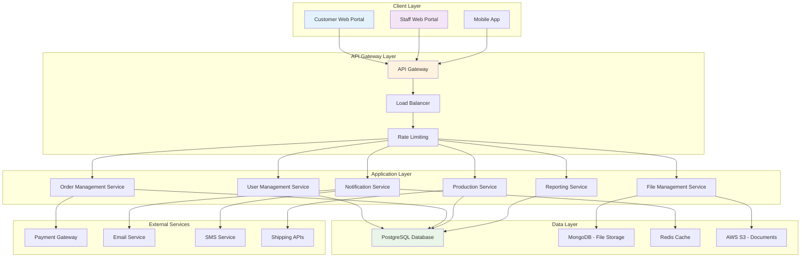
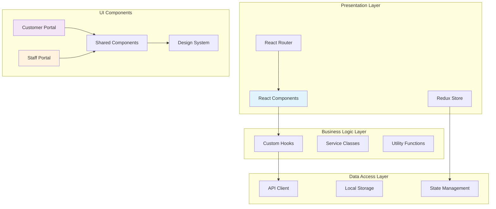
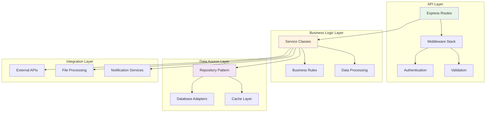
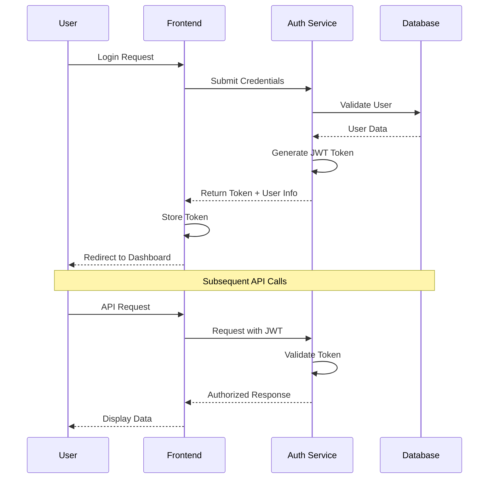
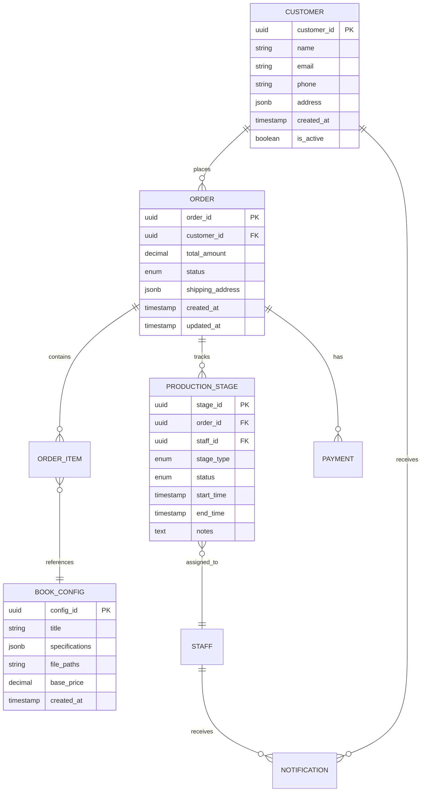
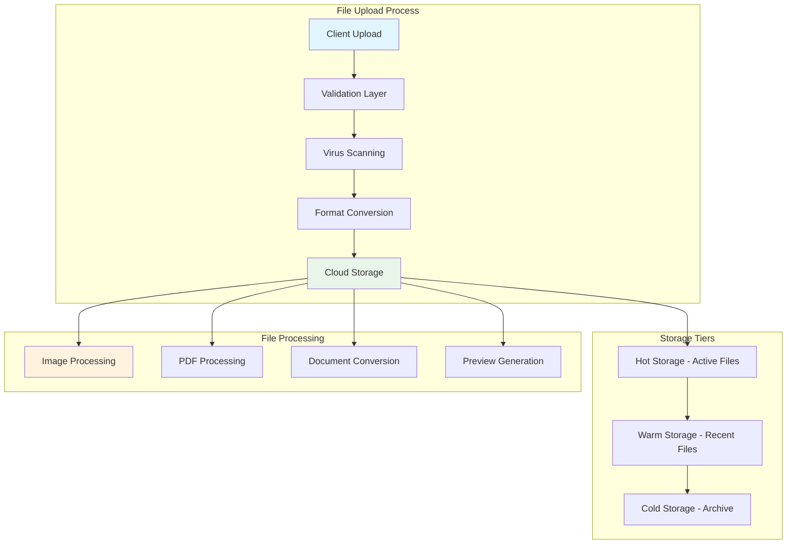
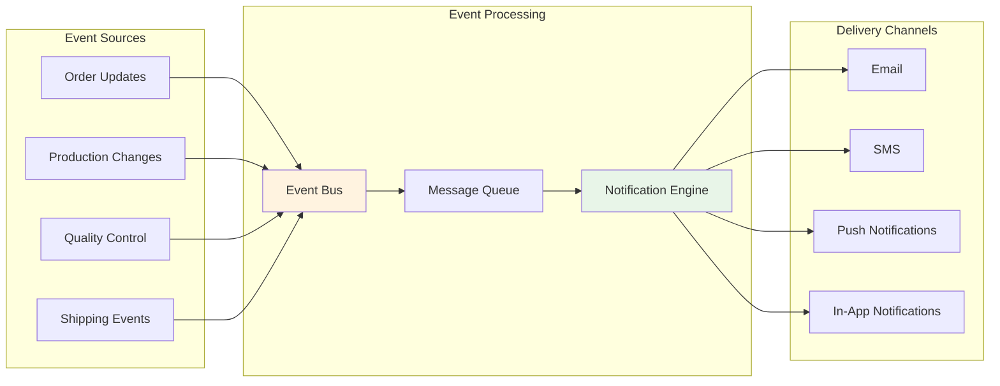
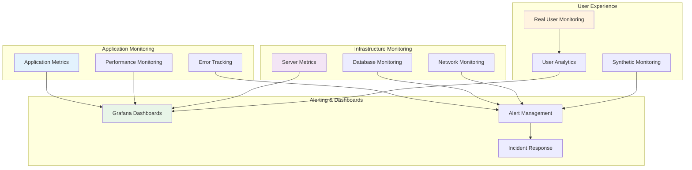
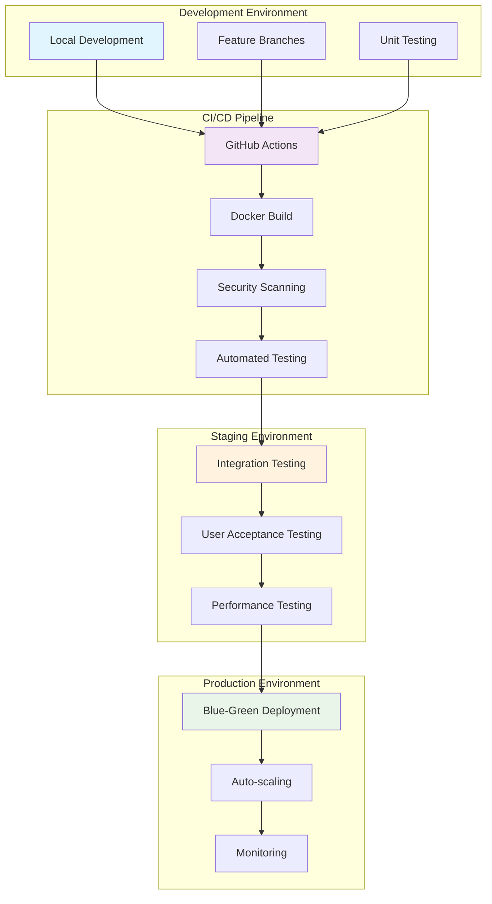

# 🏗️ PrintingHouseMS - Technical Architecture Document

## 📋 Document Overview

| **Document Info** | **Details** |
|-------------------|-------------|
| **Project** | PrintingHouseMS - Book Printing Management System |
| **Version** | 1.0 |
| **Date** | May 2025 |
| **Authors** | Development Team |
| **Status** | Architecture Design Phase |

---

## 🎯 Executive Summary

The PrintingHouseMS technical architecture is designed as a modern, scalable web-based system supporting both customer-facing and staff-facing operations. The architecture follows **microservices principles** with **RESTful APIs**, **cloud-ready deployment**, and **responsive web interfaces** to ensure reliable, secure, and maintainable book printing management operations.

### Key Architectural Decisions
- **Multi-tier architecture** with clear separation of concerns
- **RESTful API-first** design for flexibility and integration
- **Cloud-native** approach for scalability and reliability
- **Security-first** implementation with role-based access control
- **Real-time notifications** for enhanced user experience

---

## 🏛️ System Architecture Overview



---

## 🖥️ Technology Stack

### **Frontend Technologies**

| **Component** | **Technology** | **Justification** |
|---------------|----------------|-------------------|
| **Framework** | React.js 18+ | • Component-based architecture<br>• Large ecosystem and community<br>• Excellent performance with virtual DOM<br>• Strong TypeScript support |
| **State Management** | Redux Toolkit | • Predictable state management<br>• Time-travel debugging<br>• Middleware support for async operations |
| **UI Framework** | Material-UI (MUI) | • Google Material Design principles<br>• Comprehensive component library<br>• Built-in accessibility features<br>• Responsive design capabilities |
| **Styling** | Styled Components + CSS Modules | • Component-scoped styling<br>• Dynamic styling based on props<br>• Better maintainability |
| **3D Visualization** | Three.js | • Book preview and visualization<br>• Interactive 3D models<br>• WebGL performance |
| **Charts & Analytics** | Recharts + D3.js | • Business intelligence dashboards<br>• Interactive data visualizations<br>• Customizable chart components |

### **Backend Technologies**

| **Component** | **Technology** | **Justification** |
|---------------|----------------|-------------------|
| **Runtime** | Node.js 18+ LTS | • JavaScript ecosystem consistency<br>• Excellent I/O performance<br>• Large package ecosystem (npm)<br>• Active community support |
| **Framework** | Express.js + Fastify | • Express for rapid development<br>• Fastify for high-performance APIs<br>• Middleware ecosystem<br>• RESTful API support |
| **Language** | TypeScript | • Type safety and better IDE support<br>• Enhanced code maintainability<br>• Better refactoring capabilities<br>• Compile-time error detection |
| **API Documentation** | OpenAPI/Swagger | • Standardized API documentation<br>• Interactive API testing<br>• Code generation capabilities |
| **Authentication** | JWT + Passport.js | • Stateless authentication<br>• Multi-strategy authentication<br>• Session management<br>• Role-based access control |

### **Database Technologies**

| **Component** | **Technology** | **Justification** |
|---------------|----------------|-------------------|
| **Primary Database** | PostgreSQL 15+ | • ACID compliance for transactional data<br>• Advanced indexing capabilities<br>• JSON support for flexible schemas<br>• Excellent performance and reliability |
| **Document Storage** | MongoDB 6+ | • Flexible schema for file metadata<br>• Horizontal scaling capabilities<br>• Rich query language<br>• GridFS for large file handling |
| **Caching** | Redis 7+ | • In-memory data structure store<br>• Session storage<br>• Real-time features support<br>• Pub/Sub for notifications |
| **Search Engine** | Elasticsearch | • Full-text search capabilities<br>• Analytics and reporting<br>• Real-time indexing<br>• Scalable search operations |

### **Cloud & Infrastructure**

| **Component** | **Technology** | **Justification** |
|---------------|----------------|-------------------|
| **Cloud Platform** | AWS / Azure | • Comprehensive service ecosystem<br>• Auto-scaling capabilities<br>• Global infrastructure<br>• Enterprise-grade security |
| **Containerization** | Docker + Kubernetes | • Consistent deployment environments<br>• Microservices orchestration<br>• Auto-scaling and load balancing<br>• Rolling updates and rollbacks |
| **File Storage** | AWS S3 / Azure Blob | • Unlimited scalable storage<br>• CDN integration<br>• Versioning and backup<br>• Cost-effective for large files |
| **Monitoring** | Prometheus + Grafana | • Application performance monitoring<br>• Custom metrics and alerting<br>• Visual dashboards<br>• Integration with Kubernetes |

---

## 🎨 Application Architecture

### **Frontend Architecture**



### **Backend Architecture**



---

## 🔐 Security Architecture

### **Security Framework**

| **Layer** | **Security Measures** | **Implementation** |
|-----------|----------------------|-------------------|
| **Network** | • SSL/TLS encryption<br>• Firewall rules<br>• DDoS protection | • HTTPS everywhere<br>• WAF (Web Application Firewall)<br>• Rate limiting |
| **Application** | • Input validation<br>• SQL injection prevention<br>• XSS protection | • Parameterized queries<br>• Content Security Policy<br>• OWASP security headers |
| **Authentication** | • Multi-factor authentication<br>• Password policies<br>• Session management | • JWT tokens<br>• OAuth 2.0 integration<br>• Password hashing (bcrypt) |
| **Authorization** | • Role-based access control<br>• Permission matrices<br>• Resource-level security | • Custom RBAC system<br>• API endpoint protection<br>• Data row-level security |
| **Data** | • Encryption at rest<br>• Encryption in transit<br>• Data masking | • Database encryption<br>• PII data protection<br>• Secure file storage |

### **Authentication Flow**



---

## 📊 Database Architecture

### **Database Schema Strategy**



### **Data Management Strategy**

| **Aspect** | **Strategy** | **Implementation** |
|------------|--------------|-------------------|
| **Partitioning** | Time-based partitioning for orders | • Monthly partitions for order data<br>• Automated partition management<br>• Archive old partitions |
| **Indexing** | Strategic indexing for performance | • B-tree indexes on primary keys<br>• Composite indexes for common queries<br>• GIN indexes for JSON columns |
| **Backup & Recovery** | Automated backup strategy | • Daily full backups<br>• Continuous WAL archiving<br>• Point-in-time recovery capability |
| **Replication** | Master-slave replication | • Read replicas for reporting<br>• Automatic failover<br>• Cross-region replication |

---

## 🔄 API Architecture

### **API Design Principles**

| **Principle** | **Implementation** | **Benefits** |
|---------------|-------------------|-------------|
| **RESTful Design** | • Resource-based URLs<br>• HTTP methods (GET, POST, PUT, DELETE)<br>• Status codes | • Predictable API behavior<br>• Easy to understand and use<br>• Cacheable responses |
| **Versioning** | • URL versioning (/api/v1/)<br>• Header-based versioning<br>• Backward compatibility | • Smooth API evolution<br>• Client compatibility<br>• Gradual migration |
| **Documentation** | • OpenAPI/Swagger specs<br>• Interactive documentation<br>• Code examples | • Developer-friendly<br>• Reduced integration time<br>• Automated testing |
| **Error Handling** | • Consistent error formats<br>• Meaningful error messages<br>• Error codes and descriptions | • Better debugging<br>• Improved user experience<br>• Easier troubleshooting |

### **API Endpoints Overview**

```mermaid
graph LR
    subgraph "Customer APIs"
        A[/api/v1/auth]
        B[/api/v1/customers]
        C[/api/v1/orders]
        D[/api/v1/books]
        E[/api/v1/files]
    end
    
    subgraph "Staff APIs"
        F[/api/v1/staff/auth]
        G[/api/v1/staff/tasks]
        H[/api/v1/production]
        I[/api/v1/quality]
        J[/api/v1/shipping]
    end
    
    subgraph "Management APIs"
        K[/api/v1/admin/users]
        L[/api/v1/admin/reports]
        M[/api/v1/admin/settings]
        N[/api/v1/admin/inventory]
    end
    
    subgraph "Integration APIs"
        O[/api/v1/webhooks]
        P[/api/v1/notifications]
        Q[/api/v1/payments]
    end
    
    style A fill:#e3f2fd
    style F fill:#f3e5f5
    style K fill:#fff3e0
    style O fill:#e8f5e8
```

---

## 📁 File Management Architecture

### **File Storage Strategy**



### **File Management Features**

| **Feature** | **Implementation** | **Technology** |
|-------------|-------------------|----------------|
| **Upload Handling** | • Chunked upload for large files<br>• Progress tracking<br>• Resume capability | • AWS S3 Multipart Upload<br>• WebSocket for progress<br>• Client-side resumable.js |
| **Format Support** | • PDF, DOCX, InDesign files<br>• Image formats (JPG, PNG, TIFF)<br>• Vector formats (SVG, AI) | • LibreOffice for conversion<br>• ImageMagick for processing<br>• Custom format validators |
| **Preview Generation** | • PDF thumbnails<br>• 3D book previews<br>• Print-ready previews | • PDF.js for rendering<br>• Three.js for 3D<br>• Canvas API for thumbnails |
| **Security** | • Virus scanning<br>• File type validation<br>• Access control | • ClamAV antivirus<br>• MIME type checking<br>• Signed URLs for access |

---

## 🔔 Real-time Architecture

### **Notification System**



### **Real-time Features**

| **Feature** | **Technology** | **Use Case** |
|-------------|----------------|-------------|
| **WebSocket Connections** | Socket.io | • Real-time order status updates<br>• Live chat between customers and staff<br>• Production progress tracking |
| **Server-Sent Events** | Native SSE | • Notification delivery<br>• Dashboard updates<br>• System alerts |
| **Message Queuing** | Redis Pub/Sub + Bull Queue | • Background job processing<br>• File processing tasks<br>• Email sending queue |
| **Push Notifications** | Firebase Cloud Messaging | • Mobile app notifications<br>• Browser push notifications<br>• Cross-platform delivery |

---

## 📈 Performance Architecture

### **Performance Optimization Strategy**

| **Layer** | **Optimization Techniques** | **Expected Impact** |
|-----------|---------------------------|-------------------|
| **Frontend** | • Code splitting and lazy loading<br>• Image optimization and CDN<br>• Service worker caching<br>• Bundle size optimization | • 40% faster initial load<br>• 60% reduction in bundle size<br>• Improved user experience |
| **Backend** | • Response caching with Redis<br>• Database query optimization<br>• Connection pooling<br>• Async processing | • 70% reduction in response time<br>• 50% improvement in throughput<br>• Better resource utilization |
| **Database** | • Query optimization<br>• Strategic indexing<br>• Read replicas<br>• Query result caching | • 80% faster query execution<br>• Improved concurrent user support<br>• Reduced database load |
| **Infrastructure** | • Auto-scaling groups<br>• Load balancing<br>• CDN integration<br>• Edge computing | • 99.9% uptime target<br>• Global content delivery<br>• Automatic scaling |

### **Monitoring & Observability**



---

## 🚀 Deployment Architecture

### **Deployment Strategy**



### **Environment Configuration**

| **Environment** | **Purpose** | **Configuration** |
|-----------------|-------------|-------------------|
| **Development** | Local development and testing | • Local databases<br>• Hot reloading enabled<br>• Debug mode active<br>• Mock external services |
| **Staging** | Pre-production testing | • Production-like setup<br>• Automated testing<br>• Performance monitoring<br>• User acceptance testing |
| **Production** | Live system | • High availability setup<br>• Auto-scaling enabled<br>• Full monitoring<br>• Backup and disaster recovery |

---

## 🔧 DevOps & Maintenance

### **Continuous Integration/Continuous Deployment**

| **Stage** | **Tools** | **Activities** |
|-----------|-----------|---------------|
| **Source Control** | Git + GitHub | • Feature branch workflow<br>• Pull request reviews<br>• Automated branching policies |
| **Build** | GitHub Actions + Docker | • Automated builds<br>• Multi-stage Docker builds<br>• Dependency scanning |
| **Test** | Jest + Cypress + Postman | • Unit tests<br>• Integration tests<br>• End-to-end tests<br>• API testing |
| **Deploy** | Kubernetes + Helm | • Blue-green deployments<br>• Rolling updates<br>• Automatic rollbacks |
| **Monitor** | Prometheus + Grafana | • Application monitoring<br>• Infrastructure monitoring<br>• Alerting and notifications |

### **Maintenance Strategy**

| **Aspect** | **Strategy** | **Schedule** |
|------------|--------------|-------------|
| **Updates** | • Regular security updates<br>• Dependency updates<br>• Feature releases | • Security: Weekly<br>• Dependencies: Monthly<br>• Features: Bi-weekly |
| **Backups** | • Automated database backups<br>• File system backups<br>• Configuration backups | • Daily incremental<br>• Weekly full<br>• Monthly archive |
| **Monitoring** | • Performance monitoring<br>• Error tracking<br>• User analytics | • Real-time monitoring<br>• Daily reports<br>• Weekly reviews |

---

## 📊 Scalability Considerations

### **Horizontal Scaling Strategy**

| **Component** | **Scaling Approach** | **Implementation** |
|---------------|---------------------|-------------------|
| **Web Servers** | Load balancer + multiple instances | • Auto-scaling groups<br>• Health checks<br>• Session clustering |
| **Application Services** | Microservices architecture | • Independent scaling<br>• Service mesh<br>• Circuit breakers |
| **Databases** | Read replicas + sharding | • Master-slave replication<br>• Horizontal partitioning<br>• Connection pooling |
| **File Storage** | Distributed storage | • CDN for static content<br>• Multiple storage regions<br>• Automatic failover |

### **Performance Targets**

| **Metric** | **Target** | **Measurement** |
|------------|------------|-----------------|
| **Response Time** | < 200ms for API calls | 95th percentile |
| **Throughput** | 1000+ concurrent users | Peak load testing |
| **Availability** | 99.9% uptime | Monthly average |
| **File Upload** | 100MB+ files supported | Maximum file size |

---

## 🎯 Implementation Roadmap

### **Phase 1: Foundation (Weeks 1-4)**
- ✅ Set up development environment
- ✅ Implement core authentication system
- ✅ Create basic database schema
- ✅ Set up CI/CD pipeline
- ✅ Implement API gateway

### **Phase 2: Core Features (Weeks 5-12)**
- 🔄 Customer portal development
- 🔄 Order management system
- 🔄 File upload and processing
- 🔄 Staff portal basics
- 🔄 Production workflow

### **Phase 3: Advanced Features (Weeks 13-20)**
- ⏳ Real-time notifications
- ⏳ Reporting and analytics
- ⏳ 3D book preview
- ⏳ Mobile responsiveness
- ⏳ Performance optimization

### **Phase 4: Production Ready (Weeks 21-24)**
- ⏳ Security hardening
- ⏳ Load testing
- ⏳ Production deployment
- ⏳ Monitoring setup
- ⏳ Documentation completion

---

## 📋 Architecture Decision Records (ADRs)

### **ADR-001: Technology Stack Selection**
**Decision**: Use Node.js + React + PostgreSQL  
**Rationale**: JavaScript ecosystem consistency, strong community support, proven scalability  
**Alternatives Considered**: Python/Django, Java/Spring, .NET Core  
**Status**: Approved

### **ADR-002: Database Architecture**
**Decision**: PostgreSQL as primary database with MongoDB for file metadata  
**Rationale**: ACID compliance for transactions, JSON support for flexibility  
**Alternatives Considered**: MySQL, pure NoSQL approach  
**Status**: Approved

### **ADR-003: Authentication Strategy**
**Decision**: JWT-based authentication with Redis session storage  
**Rationale**: Stateless authentication, better scalability, security  
**Alternatives Considered**: Session-based auth, OAuth-only  
**Status**: Approved

---

## 🔍 Risk Assessment

| **Risk** | **Impact** | **Probability** | **Mitigation Strategy** |
|----------|------------|-----------------|------------------------|
| **Third-party API failures** | High | Medium | • Implement circuit breakers<br>• Fallback mechanisms<br>• Multiple provider options |
| **Database performance issues** | High | Low | • Query optimization<br>• Read replicas<br>• Caching strategies |
| **Security vulnerabilities** | Critical | Medium | • Regular security audits<br>• Automated scanning<br>• Security-first development |
| **Scalability bottlenecks** | Medium | Medium | • Load testing<br>• Performance monitoring<br>• Auto-scaling implementation |

---

## 📚 Technology Justification Summary

### **Why This Architecture?**

1. **Scalability**: Microservices architecture allows independent scaling of components
2. **Maintainability**: Clear separation of concerns and modular design
3. **Performance**: Caching strategies and optimized database design
4. **Security**: Multi-layered security approach with industry standards
5. **Developer Experience**: Modern tooling and comprehensive documentation
6. **Cost Effectiveness**: Cloud-native approach with pay-as-you-scale model
7. **Future-Proof**: Extensible architecture that can adapt to changing requirements

This technical architecture provides a solid foundation for the PrintingHouseMS system, balancing current requirements with future scalability needs while maintaining security, performance, and maintainability standards.

---

*Document Version: 1.0*  
*Last Updated: May 2025*  
*Next Review: June 2025*