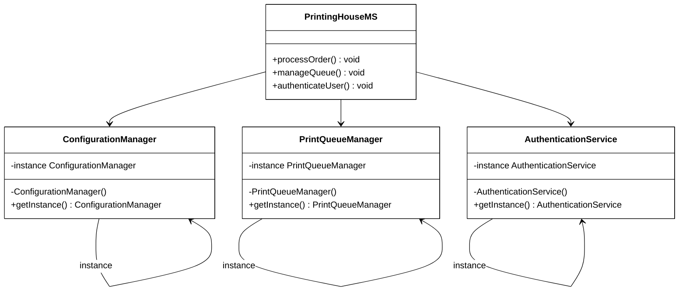

# 🧍‍♂️ Singleton Pattern Implementation

## Overview
The Singleton Pattern restricts the instantiation of a class to a single instance and provides global access to that instance. In PrintingHouseMS, this pattern ensures only one instance of critical system managers exists, providing centralized control over printing operations, authentication, and configuration.

## Problem Solved
- **Resource Control**: Prevents multiple instances of components that should only exist once
- **Global Access**: Provides a single access point to critical system services
- **State Consistency**: Ensures consistent state across the printing house application
- **System Coordination**: Centralizes management of shared resources like print queues and configurations
- **Print Job Coordination**: Prevents conflicts in printer assignments and job scheduling

## Implementation in PrintingHouseMS

### Structure

#### ConfigurationManager
ConfigurationManager ├─ -instance: ConfigurationManager (static) ├─ -printerSettings: Map ├─ -paperTypes: List ├─ -bindingOptions: List ├─ -pricingRules: Map ├─ -ConfigurationManager() (private constructor) └─ +getInstance(): ConfigurationManager (static)

#### PrintQueueManager
PrintQueueManager ├─ -instance: PrintQueueManager (static) ├─ -activeJobs: Queue ├─ -printerRegistry: Map ├─ -queueStatus: Status ├─ -PrintQueueManager() (private constructor) └─ +getInstance(): PrintQueueManager (static)

#### AuthenticationService
AuthenticationService ├─ -instance: AuthenticationService (static) ├─ -userSession: Session ├─ -tokenManager: TokenManager ├─ -securityPolicies: Map ├─ -AuthenticationService() (private constructor) └─ +getInstance(): AuthenticationService (static)

### Key Components

1. **Private Constructor**: Prevents external instantiation of critical system managers
2. **Static Instance**: Single shared instance stored as a private static field
3. **Static Access Method**: Public method to access the instance (`getInstance()`)
4. **Thread-Safety Mechanism**: Ensures thread-safe instantiation in multi-user printing environment
5. **State Management**: Maintains consistent state for printing configurations, queues, and user sessions
6. **Resource Coordination**: Centralizes management of shared printing house resources

## Benefits in Our PrintingHouseMS System

- **Centralized Print Queue Management**: All print jobs are managed through a single queue manager
- **Unified Configuration Control**: System-wide printing settings managed consistently
- **Secure Authentication**: Single authentication service ensures consistent security policies
- **Resource Optimization**: Prevents redundant instances of resource-intensive printing managers
- **Consistent Pricing**: Single configuration manager ensures uniform pricing across all orders
- **Print Job Coordination**: Prevents conflicts in printer assignments and job scheduling
- **Operational Efficiency**: Single point of control for all printing operations

## Usage Example Scenario - Print Order Processing Flow

### Multi-Step Process:
1. **Authentication**: User login calls `AuthenticationService.getInstance()` for credential validation
2. **Configuration Access**: Order processing calls `ConfigurationManager.getInstance()` to get pricing rules and paper types
3. **Queue Management**: New print job calls `PrintQueueManager.getInstance()` to add job to the printing queue
4. **Printer Assignment**: Queue manager uses the same instance to assign jobs to available printers
5. **Status Updates**: All system components use the same queue manager instance to track job progress
6. **Billing Calculation**: Pricing calculations use the same configuration manager instance for consistent rates
7. **Multi-User Coordination**: Multiple staff members access shared instances simultaneously for coordinated operations
8. **Security Enforcement**: All authentication requests go through the same AuthenticationService instance
9. **Configuration Changes**: Updates affect all users immediately through the shared ConfigurationManager

### Real-World Scenario:
When a customer places a printing order:
- Different parts of the system call their respective singleton instances
- All calls receive the same instance of each manager
- The managers track job specifications, user preferences, and delivery status
- System-wide policies are consistently applied
- Resource allocation and job scheduling are managed centrally to prevent conflicts

## Singleton Applied To

### 1. ConfigurationManager
- **Purpose**: Manages printer settings, paper types, binding options, and pricing rules
- **Benefits**: Ensures consistent configuration across all printing operations
- **Features**: Validates system settings and maintains printing standards

### 2. PrintQueueManager
- **Purpose**: Controls print job queue and printer registry
- **Benefits**: Manages job scheduling and printer assignments
- **Features**: Tracks queue status and job progress in real-time

### 3. AuthenticationService
- **Purpose**: Handles user authentication and session management
- **Benefits**: Manages security tokens and policies consistently
- **Features**: Ensures secure access across the printing house system

### 4. Additional Singletons (Future Implementation)
- **LoggingService**: Centralized logging for all printing operations
- **DatabaseConnectionPool**: Manages database connections for order data
- **NotificationManager**: Handles customer and staff notifications
- **ReportingEngine**: Generates system-wide reports and analytics

## Thread Safety Considerations

In a multi-user printing environment, thread safety is crucial:
- **Lazy Initialization**: Instance created only when first requested
- **Double-Checked Locking**: Prevents multiple instances in concurrent scenarios
- **Synchronized Access**: Critical sections protected for queue and configuration updates

## Singleton Pattern Diagram

## Real-World Benefits

- **Operational Efficiency**: Single point of control for all printing operations
- **Data Consistency**: Unified configuration prevents conflicting settings
- **Resource Management**: Optimal use of printers and materials through centralized queue
- **Security**: Consistent authentication and authorization across all system access points
- **Scalability**: Easy to extend with additional singleton services as the printing house grows
- **Maintenance**: Simplified system maintenance with centralized component management
- **Performance**: Reduced memory footprint and improved resource utilization
