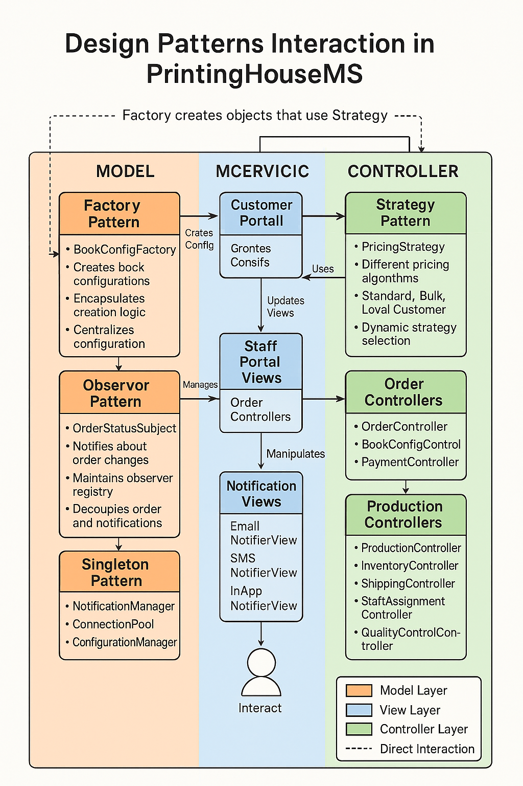

# 📚 Design Patterns in PrintingHouseMS - Summary

## Overview
This document provides a high-level summary of how design patterns are implemented in the PrintingHouseMS system. These patterns work together to create a maintainable, flexible, and robust architecture for the printing house management system.

## Patterns Implementation

| Pattern | Implementation | Primary Benefit | Key Components |
|---------|---------------|-----------------|----------------|
| **Factory** | Book configuration creation | Encapsulates instantiation logic | BookConfigFactory, BookConfig interface, Concrete book classes |
| **Observer** | Notification system | Decouples status changes from notifications | NotificationSubject, OrderStatusSubject, Concrete notification observers |
| **Strategy** | Pricing calculations | Allows dynamic pricing algorithms | PricingStrategy interface, PricingCalculator, Concrete pricing strategies |
| **Singleton** | System-wide services | Ensures single instance of critical components | NotificationManager, ConnectionPool, ConfigurationManager |
| **MVC** | Overall architecture | Separates concerns for maintainability | Models (data), Views (UI), Controllers (logic) |

## Pattern Interactions

These patterns don't exist in isolation but work together to support system functionality:

1. **Factory + Strategy**:
   - Factory creates book configurations
   - Strategy determines pricing for those configurations

2. **Observer + Singleton**:
   - Singleton NotificationManager implements Observer pattern
   - Ensures consistent notification handling throughout the system

3. **MVC + All Patterns**:
   - Factory pattern in Models layer
   - Observer pattern between Models and Views
   - Strategy pattern in Controllers
   - Singleton for system-wide services

## Benefits of Pattern-Based Architecture

1. **Modularity**: Components can be developed, tested, and maintained independently
2. **Extensibility**: New features can be added with minimal changes to existing code
3. **Reusability**: Pattern-based components can be reused across the application
4. **Testability**: Clean separation of concerns facilitates unit testing
5. **Scalability**: System can grow and evolve without major restructuring

## Pattern Implementation Considerations

1. **Performance Impact**:
   - Some patterns introduce additional complexity and indirection
   - Carefully evaluate performance-critical paths

2. **Learning Curve**:
   - Development team needs to understand pattern concepts
   - Documentation and knowledge sharing are essential

3. **Appropriate Application**:
   - Not every problem requires a design pattern
   - Avoid over-engineering simple solutions

## Diagram
