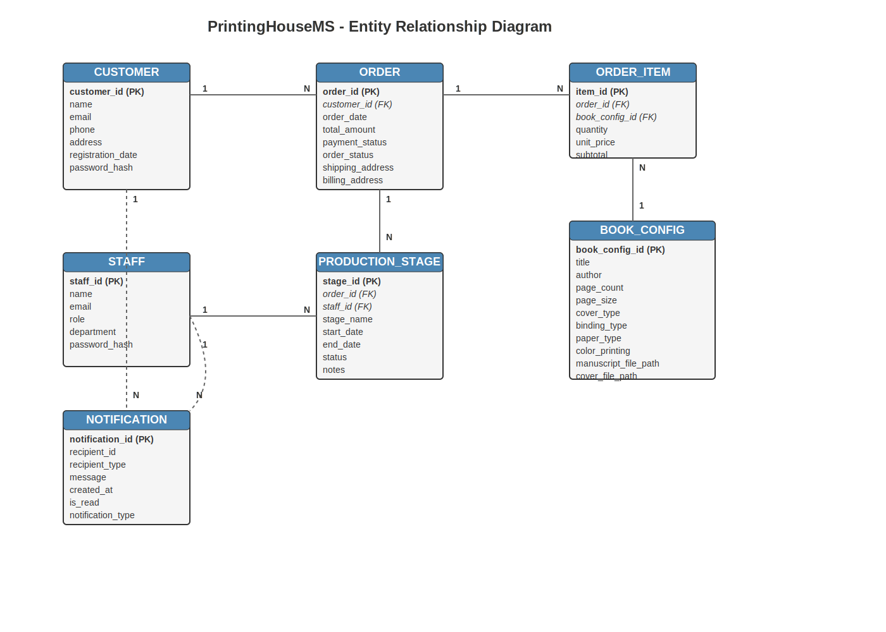

# 📚 PrintingHouseMS - Database Documentation

## 🔍 Overview
PrintingHouseMS is a database management system designed for a printing house that specializes in book production. This system manages the entire workflow from customer orders to production stages and delivery, tracking all aspects of the book printing process.

## 📊 Entity Relationship Diagram
The diagram illustrates the relationships between the core entities in the PrintingHouseMS database system. The system tracks customers, orders, book configurations, production stages, staff, and notifications.

## 📋 Entities and Attributes

### 👤 CUSTOMER
Stores information about individuals or organizations that place orders.
- **customer_id (PK)**: Unique identifier for each customer
- **name**: Customer's full name
- **email**: Customer's email address for communication
- **phone**: Customer's contact number
- **address**: Customer's physical address
- **registration_date**: Date when the customer account was created
- **password_hash**: Securely stored password for customer account access

### 🛒 ORDER
Records details of book printing orders placed by customers.
- **order_id (PK)**: Unique identifier for each order
- **customer_id (FK)**: References the customer who placed the order
- **order_date**: Date when the order was placed
- **total_amount**: Total cost of the order
- **payment_status**: Current status of payment (e.g., pending, paid, refunded)
- **order_status**: Current stage of the order (e.g., received, in production, shipped)
- **shipping_address**: Address where the finished books will be delivered
- **billing_address**: Address used for billing purposes

### 📦 ORDER_ITEM
Contains details about individual book configurations within an order.
- **item_id (PK)**: Unique identifier for each order item
- **order_id (FK)**: References the parent order
- **book_config_id (FK)**: References the book configuration for this item
- **quantity**: Number of copies to be printed
- **unit_price**: Price per copy
- **subtotal**: Total price for this item (quantity × unit_price)

### 📘 BOOK_CONFIG
Stores specifications and details about each book configuration.
- **book_config_id (PK)**: Unique identifier for each book configuration
- **title**: Title of the book
- **author**: Author of the book
- **page_count**: Total number of pages
- **page_size**: Dimensions of the book (e.g., A4, A5)
- **cover_type**: Type of cover (e.g., hardcover, softcover)
- **binding_type**: Method of binding (e.g., perfect binding, saddle stitch)
- **paper_type**: Type of paper used for interior pages
- **color_printing**: Whether the book uses color or black and white printing
- **manuscript_file_path**: Path to the uploaded manuscript file
- **cover_file_path**: Path to the uploaded cover design file

### 🏭 PRODUCTION_STAGE
Tracks the progress of orders through different production stages.
- **stage_id (PK)**: Unique identifier for each production stage record
- **order_id (FK)**: References the order being processed
- **staff_id (FK)**: References the staff member responsible for this stage
- **stage_name**: Name of the production stage (e.g., prepress, printing, binding)
- **start_date**: Date when the stage began
- **end_date**: Date when the stage was completed
- **status**: Current status of this production stage
- **notes**: Additional information or comments about the stage

### 👨‍💼 STAFF
Contains information about employees working at the printing house.
- **staff_id (PK)**: Unique identifier for each staff member
- **name**: Full name of the staff member
- **email**: Staff member's email address
- **role**: Job role (e.g., printer, binder, manager)
- **department**: Department where the staff member works
- **password_hash**: Securely stored password for staff account access

### 🔔 NOTIFICATION
Manages system notifications sent to customers and staff.
- **notification_id (PK)**: Unique identifier for each notification
- **recipient_id**: ID of the recipient (customer or staff)
- **recipient_type**: Indicates whether the recipient is a customer or staff member
- **message**: Content of the notification
- **created_at**: Timestamp when the notification was created
- **is_read**: Boolean indicating whether the notification has been read
- **notification_type**: Category of notification (e.g., order status update, production alert)

## 🔗 Relationships

1. **Customer to Order (1:N)** 👤➡️🛒
   - One customer can place multiple orders
   - Each order belongs to exactly one customer

2. **Order to Order_Item (1:N)** 🛒➡️📦
   - One order can contain multiple order items
   - Each order item belongs to exactly one order

3. **Book_Config to Order_Item (1:N)** 📘➡️📦
   - One book configuration can be used in multiple order items
   - Each order item references exactly one book configuration

4. **Order to Production_Stage (1:N)** 🛒➡️🏭
   - One order goes through multiple production stages
   - Each production stage is associated with exactly one order

5. **Staff to Production_Stage (1:N)** 👨‍💼➡️🏭
   - One staff member can be responsible for multiple production stages
   - Each production stage is managed by exactly one staff member

6. **Customer to Notification (1:N)** 👤➡️🔔
   - One customer can receive multiple notifications
   - Each notification may be directed to one customer

7. **Staff to Notification (1:N)** 👨‍💼➡️🔔
   - One staff member can receive multiple notifications
   - Each notification may be directed to one staff member

## 🎯 System Purpose

The PrintingHouseMS database system serves several key functions:

1. **👥 Customer Management**: Tracking customer information and order history
2. **📋 Order Processing**: Managing the lifecycle of book printing orders
3. **⚙️ Production Workflow**: Monitoring the progress of orders through various production stages
4. **📚 Book Configuration**: Storing detailed specifications for each book project
5. **👥 Staff Coordination**: Assigning responsibilities and tracking staff involvement
6. **📱 Notification System**: Keeping customers and staff informed about order status and production updates

This system enables efficient management of the printing house operations, from initial customer order to final delivery, while maintaining detailed records of all book configurations and production processes.

## 💡 Implementation Notes

- Primary Keys (PK) are used to uniquely identify each record in the tables
- Foreign Keys (FK) establish relationships between tables
- The cardinality notations (1:N) indicate the type of relationship between entities
- Dashed lines for notification relationships indicate optional or non-essential connections

## 🖼️ Diagram Visualization

