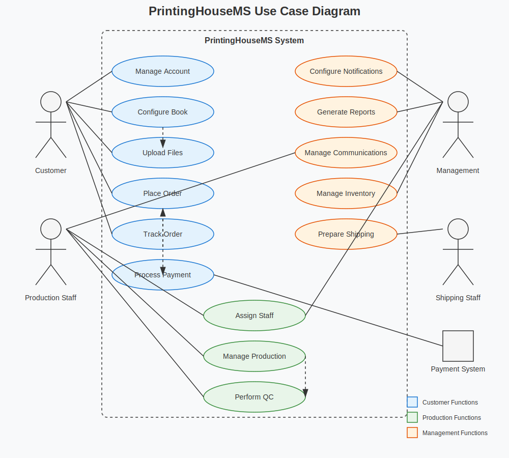

# 🖨️ PrintingHouseMS - Use Case Documentation

## 🌐 Overview
This document provides a comprehensive explanation of the PrintingHouseMS Use Case Diagram, detailing the interactions between different actors and the system. The use cases have been derived from detailed user scenarios that describe real-world workflows within the printing house management system.

## 👥 Actors and Their Roles
The system interacts with several key stakeholders, each with distinct responsibilities:

### 1. 👤 Customer
Individuals or organizations who order book printing services. Customers interact with the system's front-end interfaces to design, order, and track their print jobs.

### 2. 🛠️ Production Staff
Employees responsible for the printing production process, including prepress, printing, binding, and quality control tasks.

### 3. 📈 Management
Individuals responsible for overseeing business operations, reviewing reports, managing inventory, and setting system configurations.

### 4. 📦 Shipping Staff
Personnel responsible for preparing completed orders for shipment and managing the delivery process.

### 5. 💳 Payment System
External system that processes financial transactions.

## 🔄 Core Use Cases

### Account Management
**Manage Account** - Enables customers to create and maintain their profiles in the system.
* **Actors**: Customer
* **Description**: Customers can register, log in, update profile information, and manage their account settings.
* **Related User Scenarios**: [Customer Registration](user-scenarios/scenario-01-customer-registration.md)

### Order Management
**Configure Book** - Allows customers to specify book printing parameters.
* **Actors**: Customer
* **Description**: Customers can set specifications including dimensions, binding type, paper quality, cover options, and quantity.
* **Related User Scenarios**: [Book Configuration](user-scenarios/scenario-02-book-configuration.md)

**Upload Files** - Enables customers to provide content files for printing.
* **Actors**: Customer
* **Description**: Customers upload manuscript files and cover artwork in supported formats for production.
* **Related User Scenarios**: [File Upload](user-scenarios/scenario-03-file-upload.md)

**Place Order** - Finalizes the order creation process.
* **Actors**: Customer
* **Description**: Customers review their configurations, confirm details, and submit their order.
* **Includes**: Process Payment, Track Order
* **Related User Scenarios**: [Order Placement](user-scenarios/scenario-04-order-placement.md)

**Track Order** - Provides visibility into order status.
* **Actors**: Customer
* **Description**: Customers can monitor the progress of their order through all production stages.
* **Related User Scenarios**: [Order Tracking](user-scenarios/scenario-05-order-tracking.md)

**Process Payment** - Handles financial transactions for orders.
* **Actors**: Customer, Payment System
* **Description**: Securely processes customer payments through various payment methods.
* **Related User Scenarios**: [Payment Processing](user-scenarios/scenario-06-payment-processing.md)

### Production Management
**Assign Staff** - Allocates production resources to orders.
* **Actors**: Production Staff, Management
* **Description**: Production managers assign appropriate staff to different stages of book production based on skills and availability.
* **Related User Scenarios**: [Staff Assignment](user-scenarios/scenario-07-staff-assignment.md)

**Manage Production** - Oversees the production workflow.
* **Actors**: Production Staff
* **Description**: Staff track progress through production stages, update status, and handle production issues.
* **Includes**: Perform QC
* **Related User Scenarios**: [Production Management](user-scenarios/scenario-08-production-management.md)

**Perform QC** - Ensures quality standards are met.
* **Actors**: Production Staff
* **Description**: Quality control inspectors review finished books against quality standards before approving for shipping.
* **Related User Scenarios**: [Quality Control](user-scenarios/scenario-09-quality-control.md)

### Shipping Management
**Prepare Shipping** - Handles the logistics for delivery.
* **Actors**: Shipping Staff
* **Description**: Shipping staff package completed orders, generate shipping labels, and arrange for carrier pickup.
* **Related User Scenarios**: [Shipping Preparation](user-scenarios/scenario-10-shipping-preparation.md)

### Communication
**Manage Communications** - Facilitates information exchange.
* **Actors**: Production Staff, Customer
* **Description**: Manages customer inquiries, notifications, and internal communications regarding orders.
* **Related User Scenarios**: [Customer Communication](user-scenarios/scenario-11-customer-communication.md)

### System Administration
**Configure Notifications** - Sets up automated messaging.
* **Actors**: Management
* **Description**: Administrators configure notification templates, triggers, and delivery channels.
* **Related User Scenarios**: [Notification System](user-scenarios/scenario-12-notification-system.md)

**Generate Reports** - Produces business intelligence.
* **Actors**: Management
* **Description**: Creates analytical reports on sales, production efficiency, quality metrics, and other business performance indicators.
* **Related User Scenarios**: [Report Generation](user-scenarios/scenario-13-report-generation.md)

**Manage Inventory** - Tracks materials and supplies.
* **Actors**: Management
* **Description**: Monitors inventory levels, creates purchase orders, and manages material storage.
* **Related User Scenarios**: [Inventory Management](user-scenarios/scenario-15-inventory-management.md)

## 🔍 Relationship Types

### Include Relationships
- **Place Order** includes **Process Payment** - Payment processing is a mandatory part of placing an order.
- **Place Order** includes **Track Order** - Order tracking is automatically initiated when an order is placed.
- **Configure Book** includes **Upload Files** - File uploading follows as part of the book configuration workflow.
- **Manage Production** includes **Perform QC** - Quality control is an integral part of the production management process.

### Extend Relationships
The diagram does not explicitly show extend relationships, but potential extensions could include:
- **Upload Files** could be extended by **Request Design Services** when customers need assistance with cover design.
- **Process Payment** could be extended by **Apply Discount** in special situations.

## 🧩 Detailed Interaction Flows

### Customer Interactions
1. Customers register accounts in the system
2. They configure book specifications and upload required files
3. They place orders and make payments
4. They track order progress through production to delivery
5. They communicate with staff as needed during the process

### Production Staff Interactions
1. Staff members are assigned to production tasks
2. They update production status as work progresses
3. They perform quality control on finished products
4. They communicate with customers about production issues or questions

### Management Interactions
1. Managers configure system settings and notification parameters
2. They generate and analyze business reports
3. They manage inventory levels and material ordering
4. They oversee staff assignments and production scheduling

### Shipping Staff Interactions
1. Shipping personnel prepare completed orders for shipment
2. They generate shipping labels and documentation
3. They update order status when packages are shipped

## 📊 Implementation Considerations

### Security Requirements
- Customer account information must be securely stored
- Payment processing must follow industry security standards
- File uploads must be scanned for viruses and validated

### Performance Requirements
- File upload system must handle large manuscript files efficiently
- Order tracking updates should be available in real-time
- Report generation should be optimized for large datasets

### Usability Requirements
- Book configuration interface should be intuitive with visual aids
- Order tracking should provide clear visual indicators of progress
- Staff interfaces should streamline common workflow tasks

---
