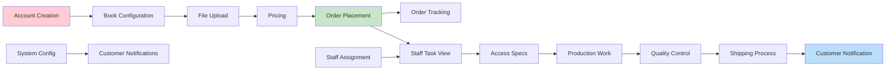

# 📖 PrintingHouseMS - User Stories

## 🌟 Overview
This document contains user stories for the PrintingHouseMS system, organized by user roles and functional areas. User stories follow the format: **"As a [user type], I want [goal] so that [benefit]"**

## 📊 User Story Summary

| **Role** | **Total Stories** | **Priority Breakdown** |
|----------|-------------------|------------------------|
| Customer | 15 stories | High: 8, Medium: 5, Low: 2 |
| Production Staff | 12 stories | High: 7, Medium: 4, Low: 1 |
| Management | 10 stories | High: 6, Medium: 3, Low: 1 |
| Shipping Staff | 6 stories | High: 4, Medium: 2, Low: 0 |
| **TOTAL** | **43 stories** | **High: 25, Medium: 14, Low: 4** |

---

## 👤 Customer User Stories

### Account Management
**US001** - *Priority: High* 📍
> **As a** customer  
> **I want** to create an account with my contact information  
> **So that** I can place orders and track my printing projects

**US002** - *Priority: Medium* 📍
> **As a** customer  
> **I want** to manage my profile and saved addresses  
> **So that** I can quickly reorder and ship to multiple locations

**US003** - *Priority: Low* 📍
> **As a** customer  
> **I want** to view my order history  
> **So that** I can reference past orders and reorder similar books

### Book Configuration
**US004** - *Priority: High* 📍
> **As a** customer  
> **I want** to configure book specifications (size, binding, paper type)  
> **So that** I can customize my book to meet my exact requirements

**US005** - *Priority: High* 📍
> **As a** customer  
> **I want** to see visual examples of binding and paper options  
> **So that** I can make informed decisions about my book's appearance

**US006** - *Priority: Medium* 📍
> **As a** customer  
> **I want** to save book configurations as templates  
> **So that** I can quickly reuse settings for future similar projects

### File Management
**US007** - *Priority: High* 📍
> **As a** customer  
> **I want** to upload manuscript files in multiple formats (PDF, DOCX, InDesign)  
> **So that** I can submit my content regardless of the software I used

**US008** - *Priority: High* 📍
> **As a** customer  
> **I want** to receive immediate feedback on file format and quality issues  
> **So that** I can fix problems before my order goes to production

**US009** - *Priority: Medium* 📍
> **As a** customer  
> **I want** to preview how my book will look before ordering  
> **So that** I can ensure the final product meets my expectations

### Pricing & Ordering
**US010** - *Priority: High* 📍
> **As a** customer  
> **I want** to see real-time pricing as I configure my book options  
> **So that** I can stay within my budget and make cost-effective choices

**US011** - *Priority: High* 📍
> **As a** customer  
> **I want** to place orders with secure payment processing  
> **So that** I can safely complete my purchase with confidence

**US012** - *Priority: Medium* 📍
> **As a** customer  
> **I want** to request custom quotes for complex or large orders  
> **So that** I can get personalized pricing for special requirements

### Order Tracking & Communication
**US013** - *Priority: High* 📍
> **As a** customer  
> **I want** to track my order status through all production stages  
> **So that** I can plan my launch date and marketing activities

**US014** - *Priority: High* 📍
> **As a** customer  
> **I want** to receive notifications about order progress and any issues  
> **So that** I stay informed without having to constantly check the system

**US015** - *Priority: Low* 📍
> **As a** customer  
> **I want** to communicate with staff about my order through the system  
> **So that** I can get answers to questions and resolve any concerns

---

## 👨‍🔧 Production Staff User Stories

### Task Management
**US016** - *Priority: High* 📍
> **As a** production staff member  
> **I want** to view my assigned tasks in priority order  
> **So that** I can focus on the most urgent work first

**US017** - *Priority: High* 📍
> **As a** production staff member  
> **I want** to access all order specifications and files from one location  
> **So that** I have everything I need to complete my work efficiently

**US018** - *Priority: Medium* 📍
> **As a** production staff member  
> **I want** to update task status as I work  
> **So that** managers and customers can track progress accurately

### Production Workflow
**US019** - *Priority: High* 📍
> **As a** production staff member  
> **I want** to document production issues and delays  
> **So that** problems can be addressed and customers can be notified

**US020** - *Priority: High* 📍
> **As a** production staff member  
> **I want** to upload photos of work in progress or completed items  
> **So that** quality can be verified and customers can see their books

**US021** - *Priority: Medium* 📍
> **As a** production staff member  
> **I want** to mark orders for quality control review  
> **So that** finished books meet our quality standards

### Quality Control
**US022** - *Priority: High* 📍
> **As a** quality control inspector  
> **I want** to use standardized checklists for different book types  
> **So that** I can ensure consistent quality evaluation

**US023** - *Priority: High* 📍
> **As a** quality control inspector  
> **I want** to document quality issues with photos and descriptions  
> **So that** problems can be understood and corrected

**US024** - *Priority: Medium* 📍
> **As a** quality control inspector  
> **I want** to approve or reject production jobs  
> **So that** only acceptable quality books proceed to shipping

### Communication
**US025** - *Priority: High* 📍
> **As a** production staff member  
> **I want** to communicate with customers about technical questions  
> **So that** I can clarify requirements and avoid mistakes

**US026** - *Priority: Medium* 📍
> **As a** production staff member  
> **I want** to escalate complex issues to supervisors  
> **So that** difficult problems can be resolved quickly

**US027** - *Priority: Low* 📍
> **As a** production staff member  
> **I want** to track my productivity and performance metrics  
> **So that** I can improve my efficiency and skills

---

## 📈 Management User Stories

### Staff & Resource Management
**US028** - *Priority: High* 📍
> **As a** production manager  
> **I want** to assign orders to appropriate staff based on skills and availability  
> **So that** work is distributed efficiently and completed on time

**US029** - *Priority: High* 📍
> **As a** production manager  
> **I want** to view real-time production status across all orders  
> **So that** I can identify bottlenecks and make scheduling adjustments

**US030** - *Priority: Medium* 📍
> **As a** production manager  
> **I want** to set priority levels for rush orders  
> **So that** urgent jobs can be expedited through production

### Analytics & Reporting
**US031** - *Priority: High* 📍
> **As a** business manager  
> **I want** to generate sales reports by time period and product type  
> **So that** I can analyze business performance and trends

**US032** - *Priority: High* 📍
> **As a** business manager  
> **I want** to view production efficiency metrics  
> **So that** I can identify areas for process improvement

**US033** - *Priority: High* 📍
> **As a** business manager  
> **I want** to track quality control statistics  
> **So that** I can monitor and improve product quality

### System Administration
**US034** - *Priority: High* 📍
> **As a** system administrator  
> **I want** to configure notification templates and triggers  
> **So that** customers and staff receive appropriate updates

**US035** - *Priority: Medium* 📍
> **As a** system administrator  
> **I want** to manage user accounts and permissions  
> **So that** system access is properly controlled

**US036** - *Priority: Medium* 📍
> **As a** inventory manager  
> **I want** to track material inventory levels  
> **So that** I can ensure adequate supplies for production

**US037** - *Priority: Low* 📍
> **As a** business manager  
> **I want** to export reports in multiple formats  
> **So that** I can share data with stakeholders and external systems

---

## 📦 Shipping Staff User Stories

### Order Processing
**US038** - *Priority: High* 📍
> **As a** shipping coordinator  
> **I want** to view orders ready for shipping in priority order  
> **So that** I can process the most important orders first

**US039** - *Priority: High* 📍
> **As a** shipping coordinator  
> **I want** to scan order barcodes to verify correct packages  
> **So that** I can prevent shipping errors and mix-ups

**US040** - *Priority: High* 📍
> **As a** shipping coordinator  
> **I want** to generate shipping labels through integrated carrier systems  
> **So that** I can streamline the shipping process

### Tracking & Communication
**US041** - *Priority: High* 📍
> **As a** shipping coordinator  
> **I want** to record tracking numbers and notify customers automatically  
> **So that** customers can monitor their shipment progress

**US042** - *Priority: Medium* 📍
> **As a** shipping coordinator  
> **I want** to handle international shipping requirements  
> **So that** I can ship orders globally with proper documentation

**US043** - *Priority: Medium* 📍
> **As a** shipping coordinator  
> **I want** to manage split shipments for large orders  
> **So that** I can optimize shipping costs and delivery times

---

## 📊 User Story Mapping Diagram

```mermaid
graph TD
    A[Customer Journey] --> B[Account Creation]
    A --> C[Book Configuration]
    A --> D[File Upload]
    A --> E[Order Placement]
    A --> F[Order Tracking]
    
    B --> B1[US001: Create Account]
    B --> B2[US002: Manage Profile]
    B --> B3[US003: View History]
    
    C --> C1[US004: Configure Specs]
    C --> C2[US005: Visual Examples]
    C --> C3[US006: Save Templates]
    
    D --> D1[US007: Upload Files]
    D --> D2[US008: File Validation]
    D --> D3[US009: Preview Book]
    
    E --> E1[US010: Real-time Pricing]
    E --> E2[US011: Secure Payment]
    E --> E3[US012: Custom Quotes]
    
    F --> F1[US013: Track Status]
    F --> F2[US014: Notifications]
    F --> F3[US015: Communication]
    
    G[Staff Workflow] --> H[Task Management]
    G --> I[Production Work]
    G --> J[Quality Control]
    G --> K[Shipping]
    
    H --> H1[US016: View Tasks]
    H --> H2[US017: Access Specs]
    H --> H3[US018: Update Status]
    
    I --> I1[US019: Document Issues]
    I --> I2[US020: Upload Photos]
    I --> I3[US025: Customer Communication]
    
    J --> J1[US022: QC Checklists]
    J --> J2[US023: Document Issues]
    J --> J3[US024: Approve/Reject]
    
    K --> K1[US038: Process Orders]
    K --> K2[US041: Track Shipments]
    K --> K3[US042: International Shipping]
    
    L[Management Operations] --> M[Resource Planning]
    L --> N[Analytics]
    L --> O[Administration]
    
    M --> M1[US028: Assign Staff]
    M --> M2[US029: Monitor Production]
    M --> M3[US036: Inventory Management]
    
    N --> N1[US031: Sales Reports]
    N --> N2[US032: Efficiency Metrics]
    N --> N3[US033: Quality Statistics]
    
    O --> O1[US034: Configure Notifications]
    O --> O2[US035: Manage Users]
    
    style A fill:#e1f5fe
    style G fill:#f3e5f5
    style L fill:#e8f5e8
```

## 🎯 Epic Breakdown

### **Epic 1: Customer Experience** (US001-US015)
- **Goal**: Enable customers to easily configure, order, and track book printing
- **Key Features**: Account management, book configuration, file upload, ordering, tracking
- **Success Metrics**: Order completion rate, customer satisfaction scores

### **Epic 2: Production Management** (US016-US027)  
- **Goal**: Streamline production workflow and ensure quality
- **Key Features**: Task management, production tracking, quality control
- **Success Metrics**: Production efficiency, quality pass rates, on-time delivery

### **Epic 3: Business Intelligence** (US028-US037)
- **Goal**: Provide management visibility and system administration
- **Key Features**: Staff management, reporting, system configuration
- **Success Metrics**: Operational efficiency, data-driven decision making

### **Epic 4: Order Fulfillment** (US038-US043)
- **Goal**: Efficient and accurate order shipping
- **Key Features**: Shipping processing, tracking, international support
- **Success Metrics**: Shipping accuracy, delivery times, customer notifications

## 🔄 Story Dependencies

## 📋 Acceptance Criteria Examples

### US004: Configure Book Specifications
**Given** I am a logged-in customer  
**When** I configure book options  
**Then** I should see:
- ✅ Visual examples of binding types
- ✅ Paper quality options with descriptions  
- ✅ Real-time price updates
- ✅ Validation of incompatible combinations
- ✅ Option to save configuration as template

### US013: Track Order Status  
**Given** I have placed an order  
**When** I view order tracking  
**Then** I should see:
- ✅ Current production stage with visual progress bar
- ✅ Estimated completion dates for each stage
- ✅ Any production issues or delays
- ✅ Contact information for questions
- ✅ Historical timeline of completed stages

### US028: Assign Staff to Orders
**Given** I am a production manager  
**When** I assign staff to orders  
**Then** I should be able to:
- ✅ View staff availability and current workload
- ✅ See staff skills and specializations
- ✅ Assign multiple staff to different production stages
- ✅ Set target completion dates
- ✅ Receive alerts for scheduling conflicts

---

## 📊 Story Prioritization Matrix

| **Story ID** | **Business Value** | **Technical Complexity** | **Priority** |
|--------------|-------------------|--------------------------|--------------|
| US001, US004, US007, US010, US011 | High | Low-Medium | **Must Have** |
| US013, US016, US017, US028, US031 | High | Medium | **Must Have** |
| US014, US019, US022, US038, US041 | High | Medium-High | **Should Have** |
| US002, US006, US018, US025, US032 | Medium | Low-Medium | **Could Have** |
| US003, US015, US027, US037, US043 | Low | Low | **Won't Have (v1)** |

---

*This user story document provides a comprehensive foundation for PrintingHouseMS development, ensuring all stakeholder needs are captured and prioritized appropriately.*