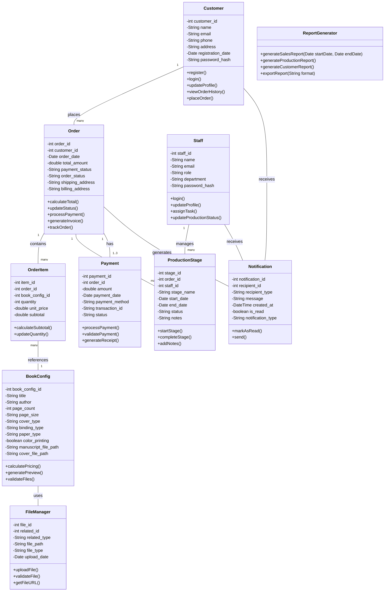

# ✒️ PrintingHouseMS - Class Diagram Documentation 📄

## Overview 📊
This document details the Class Diagram for the PrintingHouseMS system, which represents the static structure of the book printing management system. The diagram identifies the classes within the system, their attributes, operations, and the relationships between them.

## Key Components ✒️

### Customer Class 📕
- **Description**: Represents users who place book printing orders
- **Attributes**:
  - customer_id (PK)
  - name
  - email
  - phone
  - address
  - registration_date
  - password_hash
- **Operations**:
  - register()
  - login()
  - updateProfile()
  - viewOrderHistory()
  - placeOrder()
- **Relationships**:
  - One Customer places many Orders

### Order Class ✒️
- **Description**: Records details of book printing orders
- **Attributes**:
  - order_id (PK)
  - customer_id (FK)
  - order_date
  - total_amount
  - payment_status
  - order_status
  - shipping_address
  - billing_address
- **Operations**:
  - calculateTotal()
  - updateStatus()
  - processPayment()
  - generateInvoice()
  - trackOrder()
- **Relationships**:
  - One Order belongs to one Customer
  - One Order contains many OrderItems
  - One Order goes through many ProductionStages
  - One Order has one to three Payments

### OrderItem Class 📕
- **Description**: Contains details about individual book configurations within an order
- **Attributes**:
  - item_id (PK)
  - order_id (FK)
  - book_config_id (FK)
  - quantity
  - unit_price
  - subtotal
- **Operations**:
  - calculateSubtotal()
  - updateQuantity()
- **Relationships**:
  - Many OrderItems belong to one Order
  - Each OrderItem references one BookConfig

### BookConfig Class 📜
- **Description**: Stores specifications and details about each book configuration
- **Attributes**:
  - book_config_id (PK)
  - title
  - author
  - page_count
  - page_size
  - cover_type
  - binding_type
  - paper_type
  - color_printing
  - manuscript_file_path
  - cover_file_path
- **Operations**:
  - calculatePricing()
  - generatePreview()
  - validateFiles()
- **Relationships**:
  - One BookConfig can be used in many OrderItems
  - BookConfig uses FileManager for document storage

### ProductionStage Class 📉
- **Description**: Tracks the progress of orders through different production stages
- **Attributes**:
  - stage_id (PK)
  - order_id (FK)
  - staff_id (FK)
  - stage_name
  - start_date
  - end_date
  - status
  - notes
- **Operations**:
  - startStage()
  - completeStage()
  - addNotes()
- **Relationships**:
  - Many ProductionStages belong to one Order
  - Each ProductionStage is managed by one Staff member

### Staff Class 📉
- **Description**: Contains information about employees working at the printing house
- **Attributes**:
  - staff_id (PK)
  - name
  - email
  - role
  - department
  - password_hash
- **Operations**:
  - login()
  - updateProfile()
  - assignTask()
  - updateProductionStatus()
- **Relationships**:
  - One Staff member manages many ProductionStages
  - Staff receives Notifications

### Notification Class ✏️
- **Description**: Manages system notifications sent to customers and staff
- **Attributes**:
  - notification_id (PK)
  - recipient_id
  - recipient_type (customer or staff)
  - message
  - created_at
  - is_read
  - notification_type
- **Operations**:
  - markAsRead()
  - send()
- **Relationships**:
  - Generated by Orders
  - Received by Customers and Staff

### Payment Class 📊
- **Description**: Handles payment processing for orders
- **Attributes**:
  - payment_id (PK)
  - order_id (FK)
  - amount
  - payment_date
  - payment_method
  - transaction_id
  - status
- **Operations**:
  - processPayment()
  - validatePayment()
  - generateReceipt()
- **Relationships**:
  - One to three Payments belong to one Order

### FileManager Class
- **Description**: Handles file uploads and storage
- **Attributes**:
  - file_id (PK)
  - related_id
  - related_type
  - file_path
  - file_type
  - upload_date
- **Operations**:
  - uploadFile()
  - validateFile()
  - getFileURL()
- **Relationships**:
  - Used by BookConfig for manuscript and cover files

### ReportGenerator Class ✏️
- **Description**: Creates system reports for business intelligence
- **Operations**:
  - generateSalesReport()
  - generateProductionReport()
  - generateCustomerReport()
  - exportReport()

## Class Diagram Visualization📊

## Implementation Notes

- The class diagram serves as the foundation for the object-oriented implementation of the system
- Primary Key (PK) and Foreign Key (FK) notations indicate database relationships
- The relationship cardinalities (1, many, 1..3) indicate the multiplicity between classes
- Private attributes are denoted with "-" prefix, public operations with "+" prefix
- This diagram guides both frontend and backend implementation across the system

## Next Steps

The class diagram will inform:
- Database schema design
- API endpoint definitions
- User interface components
- Business logic implementation
