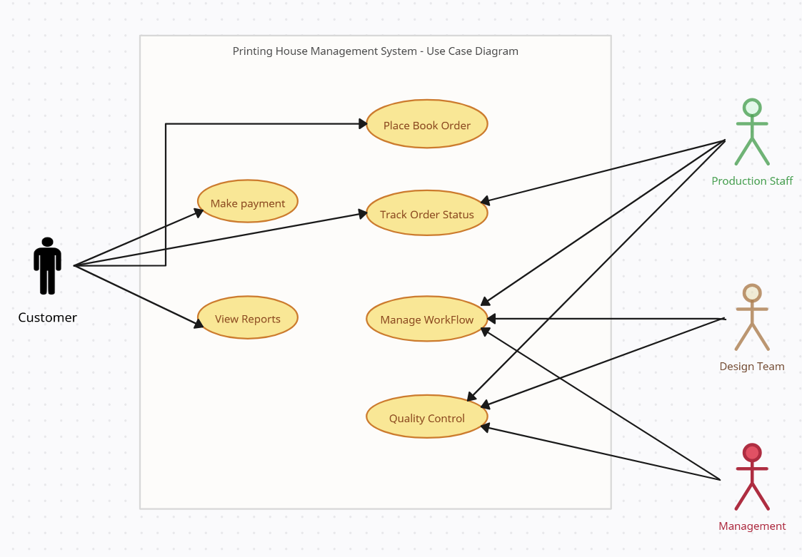

# 🖨️ Use Case Diagram Explanation

## 🌐 Overview
This use case diagram illustrates the interactions between different actors (Customer, Production Staff, Design Team, and Management) within a printing house management system. The diagram shows the various functions and processes that each actor can perform or participate in.

## 👥 Actors and Their Roles

### 1. 👤 Customer
The customer interacts with the system through several key use cases:
- **Place Book Order** 📖: Initiates the printing process by submitting a book order
- **Make Payment** 💳: Completes the financial transaction for the printing service
- **Track Order Status** 🔍: Monitors the progress of their print order
- **View Reports** 📊: Accesses information and updates about their order

### 2. 🛠️ Production Staff
The production staff is responsible for the practical execution of the printing process:
- **Manage Workflow** 📋: Coordinates the operational aspects of printing
- **Quality Control** ✅: Ensures the print quality meets required standards
- **Track Order Status** 🚥: Updates and manages order progress

### 3. 🎨 Design Team
The design team plays a crucial role in preparing the print materials:
- **Manage Workflow** 🖌️: Contributes to the design and preparation of the book
- **Quality Control** 🔬: Reviews and refines design elements before production

### 4. 📈 Management
Management oversees the entire printing process:
- **Manage Workflow** 🏗️: Provides high-level coordination and decision-making
- **Quality Control** 📊: Ensures overall quality and standards are maintained

## 🤝 Key Interactions
The diagram shows interconnected use cases that demonstrate the collaborative nature of the printing process. Each actor contributes to different stages, from order placement to final quality control, creating a comprehensive system for managing book printing.

## 🔄 Process Flow
1. 📝 Customer places an order and makes a payment
2. 🔀 Order details are routed through design, production, and management teams
3. 🕵️ Continuous tracking and quality control ensure customer satisfaction
4. 📬 Final reports and order status are made available to the customer

## 🖼️ Diagram Visualization

