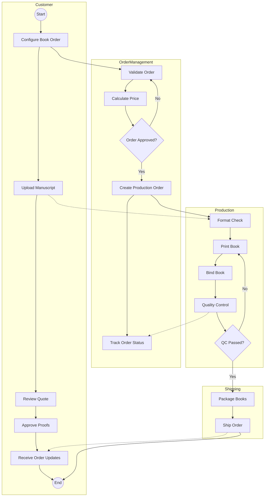

# 🏭 PrintingHouseMS - Activity Diagram Documentation

## 🎯 Overview
This document presents the Activity Diagram with swimlanes for the PrintingHouseMS system. The diagram illustrates the flow of activities during the book printing order process from initial customer configuration to final delivery, showing how different actors interact throughout the workflow.

## 🧑‍🤝‍🧑 Swimlanes (Participants)
1. **👤 Customer** – End user initiating the print request  
2. **🗂️ Order Management** – Validates and oversees order handling  
3. **🖨️ Production** – Handles printing, binding, and QC  
4. **📦 Shipping** – Packages and delivers final product  

## 🔄 Process Flow

### 👤 Customer
- Configure book specifications
- Upload manuscript files
- Review quote and approve proofs
- Receive status updates and final order

### 🗂️ Order Management
- Validate input and files
- Generate pricing
- Approve/reject orders
- Create production order
- Monitor progress and update customer

### 🖨️ Production
- Format manuscript
- Print, bind, and inspect books
- Rework failed items

### 📦 Shipping
- Package books
- Coordinate shipping
- Send tracking info

## 🧠 Decision Points
1. **📝 Order Approved?**
   - ✔️ Yes → Proceed to Production  
   - ❌ No → Return to validation  
2. **🔍 Quality Check Passed?**
   - ✔️ Yes → Ship  
   - ❌ No → Reprint  

## 🔁 Cross-Lane Interactions
- **Customer → Order Management**: Submit order  
- **Order Management → Production**: Assign task  
- **Production → Shipping**: Send finished books  
- **Shipping → Customer**: Deliver and notify  
- **All → Customer**: Notify status  

## 🖼️ Activity Diagram

## Implementation Considerations

- Each swimlane represents a different department or stakeholder in the printing process
- The flow shows both the happy path and exception handling for quality issues
- Status updates occur throughout the process to keep the customer informed
- The diagram serves as a blueprint for workflow implementation in the system

This activity diagram will guide the development of user interfaces, business logic, and system integration points to ensure a smooth book printing process from order to delivery.
