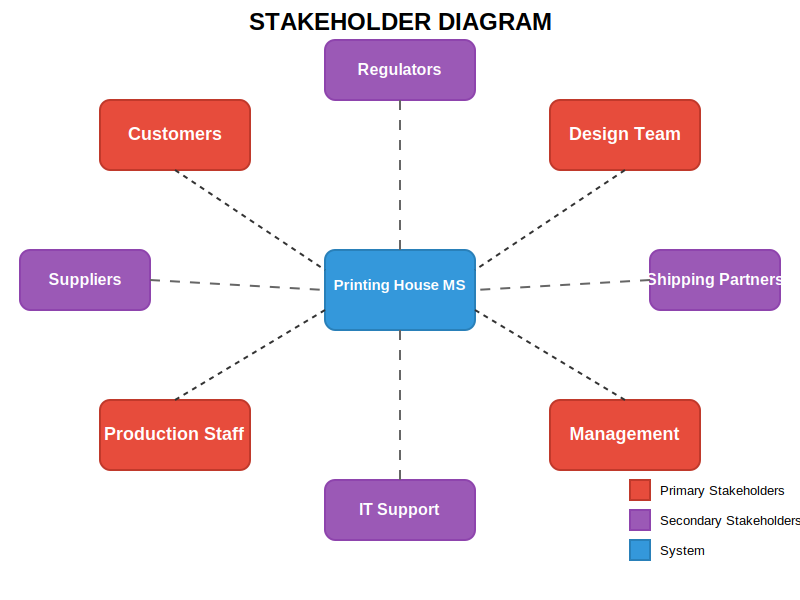

# Stakeholders Identification Table

| Stakeholder | Stakeholder Role/Responsibility | Importance | Influence | Interests/Positive Impacts | Concerns |
|------------|--------------------------------|------------|-----------|----------------------------|----------|
| **Customers** | • Directly using the product for specific business or personal needs • Solving critical problems through product utilization • Primary end-users seeking solution-driven outcomes | High | High | • Transformative problem-solving capabilities • Significant efficiency improvements (40-60% potential) • Innovative solutions to existing challenges • Direct value creation in their work/life processes | • Product integration complexity • Learning curve • Long-term reliability • Cost-effectiveness • Potential workflow disruptions |
| **Production Staff** | • Directly responsible for manufacturing and quality control • Implementing product creation processes • Ensuring operational excellence and efficiency | Medium-High | Medium | • Streamlined production workflows • Reduced manual labor requirements • Potential for 25-35% productivity enhancement • Skill development opportunities • Advanced technological interaction | • Potential job role modifications • Technology adaptation challenges • Workplace process reengineering • Skill obsolescence risks • Ergonomic adjustments |
| **Management** | • Strategic decision-makers • Overseeing product development and market positioning • Evaluating organizational impact and business performance | High | High | • Enhanced competitive market positioning • Potential 20-30% operational efficiency improvement • New revenue stream generation • Strategic business growth opportunities • Innovative organizational capabilities | • Return on Investment uncertainty • Market expansion risks • Long-term sustainability concerns • Alignment with organizational vision • Potential disruptive business model changes |
| **Design Team** | • Product conceptualization and design • Technical and business requirement identification • Innovation and creative problem-solving | High | Medium-High | • Cutting-edge technological innovation • Creative solution development • Technical challenge resolution • Pushing design and technological boundaries • Professional growth through complex projects | • Technical and resource constraints • Balancing innovation with practicality • Meeting diverse stakeholder expectations • Complex design challenge management • Potential creative limitations |
| **Suppliers** | • Critical component and service providers • Supporting product development infrastructure • Ensuring quality and timely material delivery | Medium | Medium | • Long-term business partnership opportunities • Potential market segment expansion • Technological collaboration • Innovation ecosystem participation • Diversified business relationships | • Supply chain volatility • Technological compatibility challenges • Pricing and contract negotiation complexities • Market dependency risks • Potential investment requirements |
| **Shipping Partners** | • Product distribution management • Logistics and transportation coordination • Ensuring safe and timely product delivery | Medium | Medium | • Logistics operation optimization • Advanced tracking mechanism implementation • Technological integration opportunities • Efficiency enhancement potential • Process modernization | • Transportation and regulatory complexities • Cost management challenges • Technology integration difficulties • Performance consistency • Compliance requirements |
| **IT Support** | • Technical infrastructure provision • System compatibility assurance • Implementation and troubleshooting support | Medium-High | Medium | • Technical system optimization • Advanced technological skill development • Infrastructure enhancement opportunities • Innovative problem-solving platforms • Technological challenge engagement | • Complex system integration • Cybersecurity management • Continuous learning requirements • Technical complexity navigation • Maintenance and support challenges |

**Strategic Insights:**
- Holistic stakeholder ecosystem requires adaptive, collaborative approach
- Each group provides unique perspectives and potential value
- Success depends on continuous communication and strategic alignment
  
#

