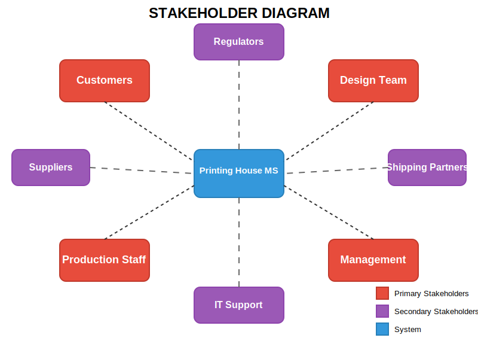

# Key Questions for Printing House Stakeholders

## Customers

"We want to understand how you use printing services and what would make your experience better."

1. What frustrates you most about ordering printed books?
2. How do you prefer to check the status of your orders?
3. What would an ideal book preview look like to you?
4. How do you currently handle file uploads for large documents?

## Production Staff

"Your insights on the production process are valuable for designing an efficient system."

1. What information do you absolutely need to start working on an order?
2. What common issues do you face with customer files?
3. How do you prioritize jobs during busy periods?
4. What would make tracking production status easier?

## Management

"We want to ensure the system provides the oversight and data you need."

1. What reports are critical for your decision-making?
2. How do you currently manage inventory and supplies?
3. What business metrics matter most to your printing operation?
4. How do you want to be alerted about production issues?

## Design Team

"Your role in translating customer needs into printable designs is crucial."

1. How do you currently share design proofs with customers?
2. What would improve your revision and approval process?
3. What design-related information do you need from customers?
4. What technical challenges do you face with complex designs?

## Other Stakeholders

"We need to understand how the system connects to your work."

1. **Suppliers**: How could we improve the ordering process for materials?
2. **Shipping Partners**: What order details do you need to process deliveries efficiently?
3. **IT Support**: What security and maintenance concerns should we address?

## For Everyone

"A few general questions to help us build a better system."

1. What's one feature that would make your job significantly easier?
2. What information do you need to share with other departments?
3. How comfortable are you with learning new technology?

## Stakeholder Diagram

